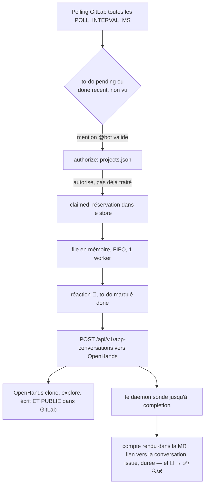

# cds-agent — branche `openhands`

Un daemon qui surveille les to-dos GitLab d'un compte bot, détecte une mention
`@bot` dans un commentaire ou une description, et **délègue tout le travail à
une instance [OpenHands](https://openhands.dev) auto-hébergée**. Le daemon ne
clone pas, n'exécute pas de modèle, ne vérifie pas ce qui est produit et ne
publie pas les remarques : il détecte, autorise, accuse réception, dispatche,
et rapporte le lien vers la conversation.

> **Cette branche est une moitié d'expérience.** L'autre moitié est
> [`hardening`](../../tree/hardening), qui fait le travail lui-même : clone,
> sandbox Docker durcie, passes multiples, garde-fou de périmètre, tests
> rejoués côté hôte, publication vérifiée. La question posée est simple —
> **le montage maison fait-il mieux qu'OpenHands tel quel ?** On y répond en
> changeant de branche avec le même `.env` et le même `projects.json`, pas en
> basculant un réglage : aucun chemin mort ne traîne dans le code de l'autre.
>
> Tout ce qui est propre à OpenHands — montage de l'instance, configuration
> des prompts et des compétences, ce qui a été vérifié dans l'API et ce qui ne
> l'a pas été — vit dans **[`docs/openhands.md`](./docs/openhands.md)**. À
> lire avant de brancher un dépôt qui compte.

**C'est un POC**, pas un service prêt pour la production : la file de tâches
est en mémoire (perte au redémarrage), un seul daemon traite un seul PAT
GitLab, il n'y a pas de webhook (uniquement du polling), et le daemon ne
revérifie rien de ce qu'OpenHands publie ou pousse. La section
[Limites connues](#limites-connues) liste ce qui est vraiment couvert et ce
qui ne l'est pas.

## Sommaire

- [Fonctionnement](#fonctionnement)
- [Prérequis](#prérequis)
- [Installation](#installation)
- [Configuration](#configuration)
- [Configuration des projets](#configuration-des-projets)
- [Ce que le bot publie](#ce-que-le-bot-publie)
- [Lancement](#lancement)
- [Déploiement (docker compose)](#déploiement-docker-compose)
- [Journalisation](#journalisation)
- [Observabilité](#observabilité)
- [Ce qui protège encore, et ce qui ne protège plus](#ce-qui-protège-encore-et-ce-qui-ne-protège-plus)
- [Limites connues](#limites-connues)
- [Tests](#tests)
- [Documentation complémentaire](#documentation-complémentaire)
- [Licence](#licence)

## Fonctionnement



Déroulé, dans l'ordre :

1. **Polling** — toutes les `POLL_INTERVAL_MS` (30 s par défaut), le daemon
   récupère les to-dos GitLab `pending` du compte bot, plus les `done`
   récents (fenêtre `LOOKBACK_MINUTES`) pour rattraper un to-do que le bot
   aurait lui-même résolu avant de l'avoir lu.
2. **Détection de la demande** — un to-do n'est retenu que si l'action est
   `mentioned`/`directly_addressed`, la cible une issue ou une MR, et le
   texte (commentaire ou description) contient littéralement `@BOT_USERNAME`.
   Une note système, ou écrite par le bot lui-même, est ignorée.
3. **Autorisation** — un dépôt doit avoir sa propre entrée dans `projects.json`
   avec l'auteur dans sa liste `users` : *fail-closed* (dépôt absent ou `users`
   vide ⇒ rien n'est autorisé). Un dépôt hors périmètre est refusé
   silencieusement (pas de commentaire, pour ne pas révéler l'existence du
   bot) ; un auteur refusé sur un dépôt présent dans le fichier reçoit une
   réponse explicite. Un dépôt qui n'accorde **aucune** capacité sur les merge
   requests est refusé avec un message qui le dit.
4. **Réservation** — la demande est enregistrée `claimed` dans un journal
   append-only (`STATE_FILE`) avant toute autre écriture, pour qu'un crash à
   ce stade ne rejoue jamais une demande déjà accusée.
5. **Accusé de réception** — réaction `:eyes:` sur le message du demandeur,
   aucune note ; le to-do est marqué `done` côté GitLab à ce stade.
6. **File** — poussée dans une file en mémoire strictement séquentielle (un
   seul worker à la fois, quel que soit le dépôt).
7. **Dispatch** — le worker lit la merge request pour connaître sa **branche
   source** (le seul appel GitLab supplémentaire : sans elle OpenHands
   travaillerait sur la branche par défaut), puis démarre une conversation
   OpenHands avec le dépôt, la branche, le texte exact de la demande encadré
   comme donnée non fiable, et les capacités accordées énoncées en toutes
   lettres. **Rien de plus** : pas de diff numéroté, pas de ticket lié, pas de
   commentaires humains récents — OpenHands explore lui-même.
8. **Attente** — sondage du démarrage (bac à sable, clone, script de setup,
   compétences) puis de l'exécution, jusqu'à un statut terminal ou
   l'expiration d'`OPENHANDS_TIMEOUT_MINUTES`.

   Une **deuxième mention sur la même merge request ne rouvre pas de
   conversation** : elle reprend celle qui existe (registre
   `state/conversations.json`). Un conteneur par MR au lieu d'un par mention,
   et l'agent garde le contexte de ce qu'il a déjà dit.
9. **Rapport** — une note portant le **lien vers la conversation**, et la
   réaction 👀 qui passe à l'une de trois issues : ✅ terminé, 🔍 à trancher
   (l'agent attend une confirmation humaine, ou le daemon a cessé d'attendre —
   la conversation, elle, continue), ❌ échec. Contrairement à `hardening`, la
   note est publiée **même quand tout s'est bien passé** : ce que l'agent a
   fait vit dans la conversation, pas dans le daemon, et sans le lien personne
   ne peut aller voir.

Seules les **merge requests** sont traitées : `src/tasks/openhands.ts` répond
poliment sur toute autre cible.

## Prérequis

- **Node.js ≥ 26** — le projet exécute ses `.ts` directement, via le
  *type-stripping* natif ; il n'y a aucune étape de build.
- **Docker** — pour l'instance OpenHands (le daemon, lui, n'en a plus besoin).
- **Un compte bot GitLab** avec un PAT de portée `api`.
- **Une instance OpenHands joignable** — voir
  [`docs/openhands.md`](./docs/openhands.md).
- **Un point d'accès d'inférence compatible OpenAI** (LM Studio, vLLM,
  Scaleway, OpenRouter…), pour OpenHands.

## Installation

```bash
git clone <ce-dépôt> && cd cds-agent
npm ci
cp .env.example .env          # puis éditez-le
cp projects.example.json projects.json
```

## Configuration

Toutes les variables sont documentées, une par une, dans
[`.env.example`](./.env.example) — nom exact, valeur par défaut, bornes de
validation, comportement si absente. `src/config.ts` charge `.env` lui-même
(mini-parseur maison, sans dépendance) puis valide chaque variable au
démarrage : une valeur hors bornes ou mal formée fait échouer le daemon
immédiatement, avec un message qui nomme la variable fautive plutôt que de
laisser une valeur absurde se propager silencieusement.

Trois variables méritent une lecture attentive :

- **`OPENHANDS_URL`** — obligatoire. Le daemon n'a aucun autre exécutant, et
  refuse de démarrer sans elle plutôt que de le découvrir après avoir accusé
  réception d'une demande. `localhost:3000` est rejeté : `new URL()` l'accepte
  en lisant `localhost:` comme un schéma, d'où un contrôle explicite du
  protocole.
- **`OPENHANDS_API_KEY`** — envoyée en en-tête `X-Session-API-Key`, et doit
  valoir la même chose que `SESSION_API_KEY` côté OpenHands. **Laissez-la vide
  en usage local** : l'interface web d'OpenHands n'envoie aucun en-tête
  d'authentification, donc poser une clé la rend inutilisable (vérifié). Ce qui
  protège l'instance par défaut est le binding du port sur `127.0.0.1`, pas une
  clé. Posez-en une si vous exposez le port — en acceptant de perdre l'UI. Le
  daemon avertit au démarrage.
- **`AGENT_MODEL`** — lue par le compose d'OpenHands, pas par le daemon.
  OpenHands passe par LiteLLM, qui n'accepte pas un nom de fournisseur
  arbitraire : écrivez `openai/<modèle>` pour un point d'accès compatible
  OpenAI. Cette forme fonctionne aussi sur `hardening` — c'est la valeur à
  retenir pour comparer les deux branches sur le même modèle.

Ce qui a **disparu** de la configuration par rapport à `hardening` :
`AGENT_TIMEOUT_MINUTES`, `PLANNER_TIMEOUT_MINUTES`, `COMMAND_TIMEOUT_MINUTES`,
`REVIEW_*`, `MIN_SEVERITY`, `MAX_REMARKS`, `CLONE_DEPTH`, `USE_DOCKER`,
`ALLOW_UNSANDBOXED`, `DOCKER_*`, `AGENT_IMAGE`, `INFERENCE_UPSTREAM_URL`,
`INFERENCE_PROXY_*`, `SANITIZED_ENV_EXTRA_KEYS`, `CDS_WORK_DIR`,
`GIT_AUTHOR_*`… — retirées avec le code qui les lisait. Une variable qui ne
fait plus rien mais reste documentée est pire qu'absente : elle laisse croire
à un levier qui n'existe pas. Ce qui les remplace vit dans la configuration
d'OpenHands et dans le dépôt relu (voir
[`docs/openhands.md`](./docs/openhands.md)).

## Configuration des projets

Les dépôts et auteurs autorisés et les capacités accordées vivent dans
`projects.json` (chemin configurable via `PROJECTS_FILE`).
`projects.example.json` en donne un modèle complet ; **le fichier ne contient
jamais de secret** — le token GitLab reste exclusivement dans l'environnement.

`projects.json` est **gitignoré**, comme `.env` : il ne porte pas de secret,
mais il nomme des dépôts internes et des utilisateurs. Conséquence assumée :
un changement de permissions ne laisse aucune trace révisable, et deux
machines peuvent diverger sans que rien ne le signale.

```json
{
  "defaults": {
    "capabilities": {
      "issue":        { "review": false, "createMergeRequest": false,
                        "writeTests": false, "writeBusinessCode": false },
      "mergeRequest": { "review": true,  "writeTests": false,
                        "writeBusinessCode": false, "pushToSourceBranch": false }
    }
  },
  "projects": {
    "groupe/depot-a": {
      "users": ["alice", "bob"],
      "capabilities": {
        "mergeRequest": { "review": true, "writeTests": true }
      }
    },
    "groupe/depot-c": {
      "users": ["alice"],
      "capabilities": {
        "mergeRequest": {
          "review": true, "writeTests": true,
          "writablePaths": ["src/generated/**", "docs/*.md"]
        }
      }
    }
  }
}
```

`projects.<chemin>` surcharge `defaults` champ par champ (fusion en profondeur
sur les capacités). Le fichier est **relu à chaud** à chaque cycle de polling ;
devenu invalide alors que le daemon tourne, la dernière configuration valide
reste en vigueur et l'erreur est journalisée bruyamment. Au démarrage, en
revanche, un fichier absent ou invalide est **fatal**.

### Ce que ces capacités font encore — et ce qu'elles ne font plus

**Elles décident toujours si une demande est acceptée.** Dépôt absent, auteur
absent de `users`, aucune capacité sur les merge requests : refusé, avant tout
appel réseau.

**Elles ne sont plus appliquées sur ce que l'agent produit.** Le daemon ne voit
pas les fichiers écrits — c'est OpenHands qui écrit et pousse. Les capacités
lui sont **énoncées dans le prompt** (`permissionStatement`,
`src/tasks/openhands.ts`) et rien de plus. Un agent qui passe outre n'est
arrêté par personne.

`commands` et `docker.image` ne sont plus lus du tout : c'est
`.openhands/setup.sh` du dépôt relu qui installe, et OpenHands qui choisit
l'image de son bac à sable. Ils restent **acceptés** dans le fichier, sans
quoi le même `projects.json` ne serait pas valide sur les deux branches.

## Ce que le bot publie

Une seule règle, la même que sur `hardening` : **une note n'est publiée que
lorsqu'elle porte une information qu'on ne peut pas obtenir autrement.**

| Moment | Ce que vous voyez |
|---|---|
| Demande prise en compte | 👀 sur votre message — *aucune note* |
| Conversation terminée | ✅ — *aucune note* |
| L'agent attend une confirmation humaine | 🔍 + une note qui le dit |
| Le daemon a cessé d'attendre (timeout) | 🔍 + une note, et **le travail continue** |
| L'agent s'est enlisé (`stuck`) ou a échoué | ❌ + la cause |
| Demande refusée (capacités, cible non gérée) | ❌ + la cause |

Ce que l'agent a réellement produit — remarques de revue, commits, merge
request — est publié **par OpenHands lui-même**, directement dans GitLab. Le
daemon ne le relaie pas et ne le vérifie pas. Sur le cas nominal il n'a donc
rien à ajouter : une note « ✅ terminé en 67 s » par-dessus ferait deux
messages pour un seul résultat, dont un qui n'apprend rien.

**Aucun lien vers la conversation OpenHands n'est publié.** Une merge request
est lue par des gens qui n'ont pas accès à l'instance, et elle lui survit : un
lien vers un outil interne y devient mort. L'adresse est **journalisée** côté
daemon, là où quelqu'un qui exploite le bot la cherchera.

Le timeout mérite une mention à part : ce n'est **ni un succès ni une panne**.
Le daemon a cessé d'attendre ; la conversation continue côté OpenHands et peut
très bien aboutir après le message. Le compte rendu le dit explicitement et
nomme le réglage qui allongerait l'attente, plutôt que de laisser croire à une
annulation qui n'a pas eu lieu.

## Lancement

```bash
npm run dev
```

Au démarrage, le journal doit afficher :

```
Exécution déléguée à OpenHands (http://127.0.0.1:3000).
⚠ Le daemon ne vérifie pas ce qui part : OpenHands publie et pousse lui-même…
OpenHands répond (GET /health → OK).
```

Une instance injoignable n'empêche **pas** le daemon de démarrer (l'ordre de
démarrage n'est pas garanti) — mais toute demande échouera tant qu'elle ne
répond pas.

## Déploiement (docker compose)

Deux fichiers, deux cycles de vie :

```bash
# 1. Le daemon (crée aussi le réseau partagé cds-agent-net)
docker compose up -d --build

# 2. L'instance OpenHands, depuis la RACINE du dépôt
docker compose --env-file .env -f docker/openhands/docker-compose.yml up -d
```

`--env-file .env` n'est pas décoratif : `env_file:` ne nourrit pas
l'interpolation `${...}` du fichier compose. Voir
[`docs/openhands.md`](./docs/openhands.md), section « Pièges rencontrés au
montage ».

L'image du daemon ne monte **plus** `/var/run/docker.sock` et n'embarque plus
ni git ni le client docker : elle ne lance aucun conteneur et ne clone rien.
Cet accès équivalent à root n'a pas disparu du déploiement pour autant — il a
changé de mains, et c'est OpenHands qui le détient désormais.

## Journalisation

`src/log.ts` émet une ligne JSON par événement (`ts`, `level`, `msg`).
`LOG_LEVEL` filtre les niveaux (`debug`/`info`/`warn`/`error`, défaut `info`) ;
`LOG_PRETTY=1` bascule vers une ligne condensée pensée pour un terminal humain
(`12:03:45.123 INFO [note:42 grp/repo!7] message`).

**Corrélation** : `AsyncLocalStorage` propage `key`/`projectPath`/`iid` à
travers toute la chaîne d'appels asynchrones d'une demande. Deux fenêtres
distinctes couvrent son cycle de vie — `handle()` (réception → mise en file) et
`trackedWorker()` (exécution réelle, potentiellement démarrée bien plus tard).
Une ligne émise hors de ces fenêtres ne porte aucun de ces trois champs :
jamais de valeur inventée.

## Observabilité

Un serveur HTTP minimal (`node:http`, zéro dépendance) expose deux routes :

- **`GET /healthz`** — `200` nominal, `503` si dégradé : dernier polling
  réussi remontant à plus de 3×`POLL_INTERVAL_MS`, ou tâche en cours dépassant
  la durée légitime maximale (`OPENHANDS_TIMEOUT_MINUTES` + le plafond de
  démarrage d'une conversation + une marge de sondage — 16 min avec les
  défauts). La réponse inclut la profondeur de la file, la tâche en cours
  (`key`/`projectPath`/`iid`, jamais le texte de la demande) et les compteurs.
- **`GET /metrics`** — exposition texte façon Prometheus : profondeur de la
  file, durée de la tâche en cours, compteurs cumulés (traitées, refusées,
  abandonnées).

`HEALTH_ENABLED=0` désactive complètement le serveur ;
`HEALTH_PORT`/`HEALTH_HOST` en configurent l'écoute (`127.0.0.1:8090` par
défaut). Aucune des deux routes n'expose de token, de contenu de dépôt, ni de
texte de demande.

## Ce qui protège encore, et ce qui ne protège plus

**Ce qui tient toujours** — tout l'amont, inchangé et testé :

- listes blanches *fail-closed* par dépôt et par auteur (`daemon/authorize.ts`),
  avec silence délibéré sur un dépôt hors périmètre ;
- journal d'idempotence : une demande déjà traitée n'est jamais rejouée, une
  demande interrompue en cours d'exécution n'est jamais rejouée
  automatiquement ;
- verrou d'instance, arrêt gracieux, réessais bornés sur les erreurs GitLab
  transitoires — jamais sur une écriture (un commentaire publié deux fois est
  pire qu'un échec) ;
- **neutralisation des mentions et des quick actions** (`defuseMentions`) sur
  tout texte non maîtrisé republié par le daemon : un message d'erreur qui
  recopierait une réponse d'API ne peut ni notifier `@tout-le-monde` ni
  exécuter une quick action avec le PAT du bot ;
- le texte de la demande est transmis à OpenHands **encadré comme une donnée**,
  avec la mention explicite qu'il n'accorde aucune permission, et les limites
  réelles énoncées **après** lui.

**Ce qui a disparu** — et c'est le cœur du compromis :

| Garantie sur `hardening` | Ici |
|---|---|
| Périmètre des fichiers modifiés vérifié avant le push | **Disparue.** Une consigne dans le prompt |
| Tests de référence rejoués côté hôte avant publication | **Disparue.** OpenHands décide seul de ce qu'il livre |
| Contrôle de `HEAD` et de `.git` après exécution | **Disparue** |
| Remarques validées et repositionnées avant publication | **Disparue.** OpenHands commente directement |
| Sandbox `--cap-drop ALL --read-only --network none` | **Remplacée** par le bac à sable d'OpenHands, avec ses réglages |
| Jeton GitLab jamais confié à un processus non fiable | **Abandonné.** OpenHands le détient, en écriture |

Ce qui est perdu doit être regagné par la **configuration d'OpenHands** — les
hooks `stop` de `.openhands/hooks.json` en sont le levier le plus proche. Voir
[`docs/openhands.md`](./docs/openhands.md).

## Limites connues

Dans l'ordre où elles comptent :

- **Rien n'a été exécuté contre une instance OpenHands réelle** pendant la
  rédaction de ce code. Le client est testé unitairement contre un `fetch`
  simulé ; la forme du JSON a été relue dans les modèles Pydantic du serveur.
  La liste complète de ce qui n'a pas pu être vérifié est dans
  [`docs/openhands.md`](./docs/openhands.md) — **à lire avant de faire
  confiance à ce montage**.
- **Le daemon ne vérifie rien de ce qui part.** Voir le tableau ci-dessus.
- **L'application server d'OpenHands vit dans un dépôt archivé.**
  `OpenHands/OpenHands` est devenu *Agent Canvas* à partir de `v1.8.0` ; le
  code Python qui sert `/api/v1/app-conversations` a été déplacé dans
  `OpenHands/legacy`, archivé. L'image reste celle que la documentation
  officielle donne pour l'auto-hébergement, mais c'est une décision à prendre
  consciemment si ce montage doit vivre au-delà d'une campagne de comparaison.
- **Le timeout n'annule rien.** À son expiration, le daemon rend la main mais
  la conversation continue côté OpenHands. Aucune route d'annulation propre
  n'a été trouvée.
- **File de tâches en mémoire, perte assumée au redémarrage** : une demande
  accusée mais pas encore démarrée est perdue si le daemon s'arrête avant — le
  to-do GitLab est déjà `done`, rien ne la rejouera. Une demande `running`
  interrompue n'est jamais rejouée automatiquement : elle est signalée « à
  vérifier à la main ». Voir
  [`docs/adr/0004`](./docs/adr/0004-contrat-fiabilite-file-memoire.md).
- **Polling, pas de webhook** : latence de `POLL_INTERVAL_MS`, deux appels API
  par cycle. Voir
  [`docs/adr/0001`](./docs/adr/0001-polling-plutot-que-webhook.md).
- **Verrou d'instance non atomique** (`src/daemon/lock.ts`) : fenêtre de course
  théorique entre lecture et écriture du fichier de verrou — suffisant contre
  le scénario visé (une seconde instance oubliée dans un tmux), pas contre deux
  démarrages simultanés à la milliseconde près.
- **`appendFileSync` sans `fsync`** (`src/daemon/store.ts`) : une ligne
  `claimed` peut ne jamais atteindre le disque en cas de crash brutal, auquel
  cas la demande est rejouée depuis zéro plutôt que perdue.
- **Un seul daemon, un seul worker à la fois** : pas de répartition de charge.
  Une tâche longue bloque toutes les autres, tous dépôts confondus. Voir
  [`docs/adr/0007`](./docs/adr/0007-worker-unique-et-absence-de-quotas.md).
- **Aucun quota, aucun comptage de coût** : rien ne limite le nombre de
  demandes qu'un utilisateur autorisé peut enfiler.
- **Pas de traitement spécial des fils de discussion.** Une relance dans un fil
  (« @bot j'ai pas compris ») est dispatchée comme une demande ordinaire :
  c'est à OpenHands de retrouver le fil depuis l'adresse de la MR. `hardening`
  a un chemin dédié pour ça (`tasks/explain.ts`), pas cette branche.
- **Seules les merge requests sont traitées.**

## Tests

```bash
npm test
```

294 tests, `node --test` natif, aucune dépendance de test ajoutée. La suite ne
nécessite ni Docker, ni instance OpenHands, ni token GitLab valide : le client
OpenHands est testé contre un `fetch` injecté et une horloge contrôlée (ce qui
rend les scénarios de sondage et de timeout instantanés et déterministes).
`npm run check` (`tsc --noEmit`) est le seul contrôle de types.

Les deux sont câblés **deux fois**, volontairement : dans
[`.gitlab-ci.yml`](./.gitlab-ci.yml) parce que le projet cible GitLab, et dans
[`.github/workflows/verify.yml`](./.github/workflows/verify.yml) parce que le
dépôt est publié sur GitHub. Les deux fichiers doivent rester alignés.

## Documentation complémentaire

- [`docs/openhands.md`](./docs/openhands.md) — **le document central de cette
  branche** : monter l'instance, y configurer prompts et compétences, ce qui a
  été vérifié dans l'API et où, ce qui ne l'a pas été, les pièges du montage,
  et la comparabilité avec le banc de mesure existant.
- [`docs/deployment.md`](./docs/deployment.md) — comment ce POC tourne (ou ne
  tourne pas) ailleurs qu'un terminal ouvert.
- [`docs/adr/`](./docs/adr/) — décisions d'architecture. Attention : plusieurs
  ADR décrivent des mécanismes qui n'existent **que sur `hardening`** (garde-fou
  par chemin, opencode + inférence locale, frontière de confiance patch vs
  clone). Elles sont conservées telles quelles : ce sont des décisions datées,
  pas de la documentation courante, et les réécrire effacerait le raisonnement
  que cette branche met justement à l'épreuve. Chacune porte un encadré qui dit
  ce qu'il en reste ici.

## Licence

AGPL-3.0-only — voir [LICENSE](./LICENSE).
